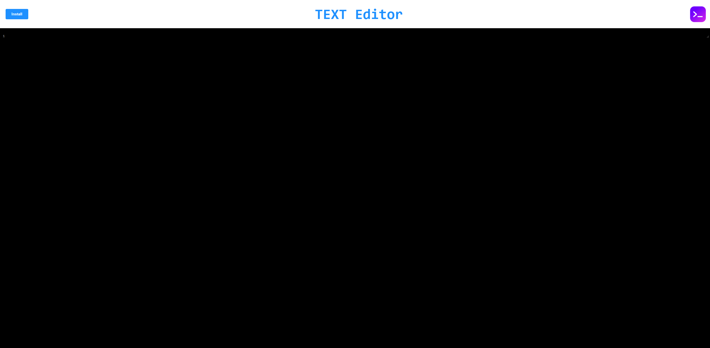

# Text Editor Web Application

This is a versatile and lightweight text editor web application designed for simplicity and efficiency. Whether you're jotting down quick notes, drafting emails, or coding snippets, this text editor provides a seamless experience with powerful features.

## Features

- **Simple Interface**: Clean and intuitive user interface for distraction-free writing.
- **Persistent Storage**: Save your work securely using IndexedDB, ensuring your content is always available even after closing the browser.
- **Offline Access**: Take your writing anywhere with offline access. The application uses service workers to cache content, allowing you to access your documents even without an internet connection.
- **Customizable**: Tailor the editor to your preferences with customizable themes, font sizes, and more.
- **Fast and Responsive**: Built with performance in mind, the editor provides a snappy and responsive experience, even with large documents.
- **Cross-Platform Compatibility**: Access your documents from any device or browser, ensuring seamless integration into your workflow.

## Usage

1. **Clone the Repository**: Get started by cloning the repository to your local machine.
2. **Installation**: Install the necessary dependencies using npm install.
3. **Build**: Build the project using npm run build.
4. **Start the Server**: Launch the server using npm start.
5. **Access the Application**: Open your web browser and navigate to http://localhost:3000 to access the text editor.

## Technologies Used

- **HTML5**: The foundation of the web application's structure and content.
- **CSS3**: Styling the user interface to provide an appealing and intuitive design.
- **JavaScript**: Powering the interactive features and functionality of the text editor.
- **IndexedDB**: Providing secure and persistent storage for user documents.
- **Webpack**: Bundling and optimizing the application's assets for performance.
- **Workbox**: Implementing service workers for offline access and caching.
- **Express**: Serving the web application and handling HTTP requests.

## screenshots

## Deployment links
https://pwa-web-app-iota.vercel.app/

https://yasirjamah123.github.io/text-editor/

